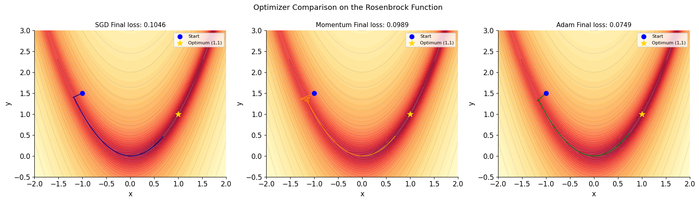
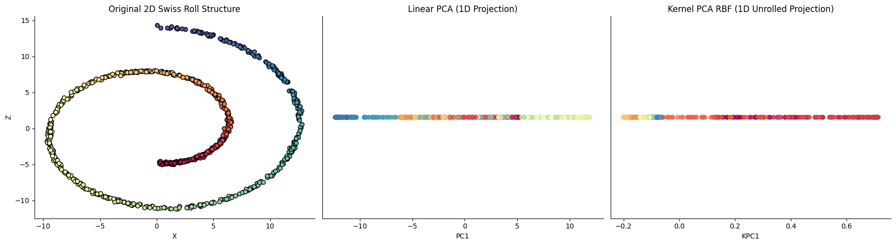

# Machine Learning from Scratch

## 1. Calculus Notebook - Optimization Algorithms from Scratch

In this notebook, I implemented **Gradient Descent**, **Stochastic Gradient Descent (SGD)**, **Momentum-Based Descent**, **RMSProp**, and the **Adam Optimizer** completely from scratch. 

The goal of this project was to dive beneath the surface of modern machine learning frameworks to understand the mathematical physics driving model training, how to effectively tune learning rates ($\alpha$), and how to select the optimal optimizer for various loss landscapes.

---

## What I Learned

### 1. The Geometry of Learning Rates & Curvature
Through implementing these algorithms, I discovered a profound mathematical link between a function's curvature and its optimal learning rate:
* The ideal learning rate is fundamentally bounded by the inverse of the function's second derivative ($1 / f''(x)$).
* In a perfect 1D or 2D world, replacing a guessed learning rate with the inverse of the second derivative (**Newton's Method**) allows the optimizer to calculate the exact structural curvature of the bowl, auto-scale its step size, and land at the absolute local minimum in **exactly one single step**.

### 2. The Computational Reality of Deep Learning
While second derivatives provide the perfect, hyperparameter-free step scale, they are not viable in modern deep learning practice:
* For a Large Language Model (like Gemini) dealing with billions or trillions of parameters, the second derivative becomes a massive grid of every parameter pair called the **Hessian Matrix**.
* Calculating and inverting a trillion-by-trillion matrix on every single training step would instantly paralyze the world's fastest supercomputers.

### 3. Why Adam Rules the AI Industry
Because calculating the true second derivative is too computationally expensive, **Adam acts as a brilliant mathematical cheat code**. 
* By maintaining an exponential moving average of squared gradients in the denominator (`v_hat`), Adam dynamically calculates a lightning-fast, cheap *approximation* of the second derivative's scaling properties.
* Combined with directional momentum (`m_hat`) in the numerator to smooth out noisy trajectories, Adam delivers the ultimate balance of **stability, noise filtering, and computational efficiency**, making it the undisputed default optimizer for modern deep learning.

#### Optimizer Comparisons

---
## 2. Linear Algebra Notebook - Dimensionality Reduction & Projections from Scratch

In this notebook, I implemented **Principal Component Analysis (PCA)**, **Singular Value Decomposition (SVD)**, and **Kernel PCA (KPCA) with an RBF Kernel** completely from scratch. 

The goal of this project was to look beyond black-box libraries to master how high-dimensional spaces are compressed, how matrix multiplications act as geometric projections, and how non-linear data structures can be mathematically "unrolled."

---

## What I Learned

### 1. Matrix Multiplications as Coordinate Perspectives
Through building PCA from scratch, I cleared up a massive misconception about dimensionality reduction:
* Performing a matrix multiplication like $X_{\text{projected}} = X_{\text{centered}} \cdot V$ does not physically slam, smash, or move data points across a graph. The original spatial relationships between points stay identical.
* Instead, eigenvectors act as full, pre-existing structural paths running through the data cloud. Multiplying by them simply rotates your perspective (a Change of Basis), mapping your data out of its raw features and using the cloud's natural axes of maximum variance as the new horizontal and vertical grid lines.

### 2. The Computational Efficiency of the SVD Path
While classic PCA solves for the eigenvectors of a squared Covariance Matrix ($\frac{X^T X}{n-1}$), this approach is highly inefficient for real-world high-dimensional data (like 64-pixel facial images or massive genomics tables):
* For a dataset with 50,000 features, building a covariance matrix forces a computer to build a staggering $50,000 \times 50,000$ grid in RAM before calculations even begin.
* Passing mean-centered data directly into **Singular Value Decomposition (SVD)** bypasses the covariance matrix entirely. SVD's right singular vectors ($V^T$) map identically to PCA's eigenvectors, but calculate the structural spine of the data in a fraction of the memory, making it the industry engine under the hood of frameworks like `scikit-learn`.

### 3. Slicing Through Curvature with the Kernel Trick
Linear PCA fails completely on curved, non-linear structures like the Swiss Roll because linear projections inevitably smash separate, overlapping layers into the exact same low-dimensional coordinates, permanently scrambling the information.
* **Kernel PCA (KPCA)** resolves this by bypassing the original space and constructing an $n \times n$ similarity grid using a Radial Basis Function (RBF Kernel).
* By tracking only localized similarity gradients, KPCA maps the data into an infinite-dimensional space where the curvature of the roll is straightened out into a linear spine, allowing standard linear algebra tools to cleanly "unroll" a non-linear universe.

#### Dimensionality Reduction Comparisons

